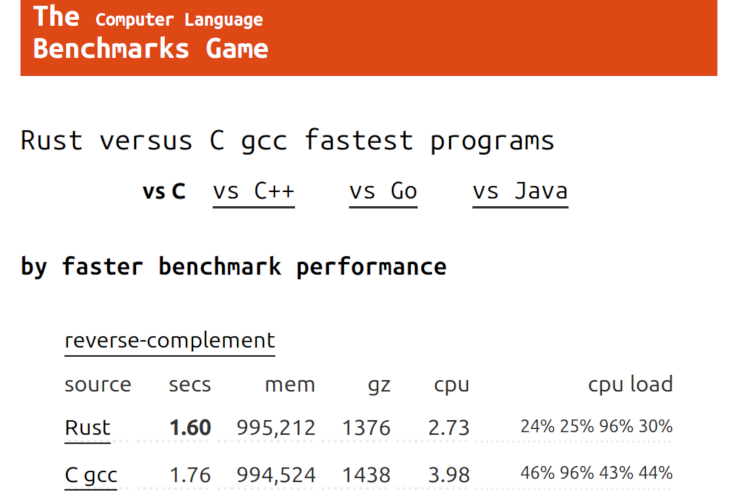
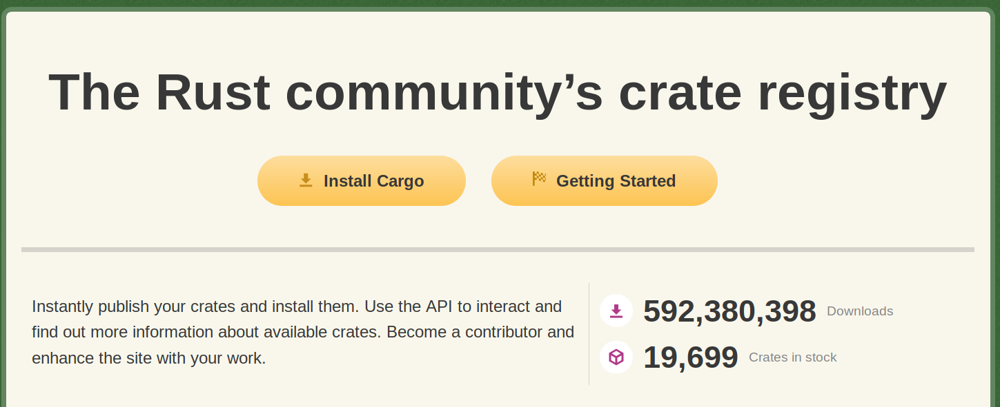

# Introduction to Rust

## [d-dorazio.github.io/rust101](https://d-dorazio.github.io/rust101) <!-- .element: target="_blank" rel="noopener" data-preview-link="false" -->

<!-- .slide: data-background="./assets/rust-logo.svg" data-background-position="top left" data-background-size="20%" data-background-opacity="0.8"-->

Note:

* Suggest reading the slides online since there will be code to read and try on
  the playground.
* ask participants their background, if coming from c/c++ some concepts will be
  easier than others.

---

## What is Rust?

Rust is a programming language for writing and maintaining fast, reliable, and
small-footprint code.

Note: this is the new definition, but it's too generic 'cause any language
claims to be like that.

----

## What is Rust?

Rust is a systems programming language that runs blazingly fast, prevents
segfaults, and guarantees thread safety.

Note: this definition is too technical(systems programming language, segfaults,
thread safety, etc...) and I don't like it much...

----

## What is Rust?

Rust is a modern programming language that provides zero-cost abstractions to
write correct and fast code.

Note:
* focus on _modern_: some new languages already feel old and outdated.
* define what zero-cost abstractions means.

----

<!-- .slide: data-background="./assets/king-arthur.gif" -->

Note: rust is hard to learn but it's worth it!

---

## History

* Rust was firstly designed by Graydon Hoare in 2006 as a personal project.
* Mozilla supports and open sources the project in 2009-2010.
* In 2015 Rust reaches version 1.0!
* Sometimes in December later this year Rust edition 2018 will be released!

---

## Features

* Compiled
* Fast
* Modern static type system
* Safe manual memory management without garbage collection

Note:
- manual memory management is usually hard, but not that much in rust.
- macro system is not C-like, it's actually pretty good.

---

## Who's using Rust

 <!-- .element: height="150px;" style="margin: 10px;" -->
 <!-- .element: height="150px;" style="margin: 10px;" -->
 <!-- .element: height="200px;" style="margin: 10px;" -->

 <!-- .element: height="100px;" style="margin: 10px;" -->
 <!-- .element: height="150px;" style="margin: 10px;" -->

---

## Where to use Rust

* Embedded
* CLI
* WebAssembly
* Backend

Note: there are already a bunch of awesome CLI applications that rock(e.g.
ripgrep, fd and bat). System programming can be fun and colored!

---

## Why use Rust

----

# Hack without fear!

Note: use Rust when you want to experiment with things you don't know (yet)
because Rust got you covered

----

### Community


<!-- .slide: data-background="./assets/beating-heart.svg" data-background-size="20%" data-background-position="bottom right" data-background-opacity="0.5"-->

Note:
- "Choosing a programming language means also choosing a community". Rust was
  one of the first community that adopted a code of conduct, now all major
  communities are adopting it as well(e.g. Linux and Gnu).
- Most loved programming language of 2018

----

### Speed

[benchmarks](https://benchmarksgame-team.pages.debian.net/benchmarksgame/faster/rust-gpp.html)
<!-- .element: target="_blank" rel="noopener" data-preview-link="false" -->



Note:
- Rust is as fast as C/C++ because it leverages LLVM which is a hella good of a
  backend and because of zero-cost abstractions.

----

### [Documentation](https://doc.rust-lang.org/std/index.html)


Note:
- Book is awesome!
- All major crates have throughtout documentation full of examples. Some of them
  also have documentation books!

----

### Modern type system and friendly compiler


Note:
- Types help catch a lot of common errors(`undefined is not a function` or `null
  pointer exception` anyone?).
- `rustc --explain` explains the error the compiler just gave!
- The rust compiler team put substantial effort on the compiler to output
  meaningful error messages with suggestions! Most of the errors messages are so
  good that some experimental tools exist to automatically apply the
  suggestions! c++ errors suck w.r.t. this

----

### Easy integration with other languages


Note:
- Integration with other languages is easy because of the lack of a runtime and
  garbage collector.
- to talk with C there's `bindgen` which automatically generates low level rust
  bindings for C header files. The use case is to use a modern language
  leveraging the power of rust abstractions and guarantees.
- to talk with Python/Node there exists libraries that perform the binding for
  you. The use case is to speed things up because interpreted languages are
  usually slow.
- `wasm-bindgen` and `wasm-pack` for wasm
- `cgo` anyone?

---

## Why not to use rust

----

### Slow to compile


----

### Ecosystem not that rich



Note: rust ecosystem is not that big and doesn't contain everything, but it has
some really well designed libraries imho.

---

## [Hello World!](https://play.rust-lang.org/?version=stable&mode=debug&edition=2015&gist=4b9e8ad8bb89a6269d61f80989ebf76d)

```rust
fn main() {
    println!("Hello, world!");

    let question = "what's the answer to life, the universe and everything?";
    let answer = 42;
    println!("{} {}", question, answer);
}
```

Note:
- briefly mention that println! is a macro and that's why there's the ! at the
  end.
- highlight how type inference works: there's no need to specify the type of the
  variables because the compiler can automatically detect that.

----

## [Hello galaxy!](https://play.rust-lang.org/?version=stable&mode=debug&edition=2015&gist=d4d4eb527a08df5d57783d55d1f8cebd)

```rust
fn fib(n: u64) -> u64 {
    let mut a = 1;
    let mut b = 0;

    for _ in 0..n {
        let tmp = a + b;

        b = a;
        a = tmp;
    }

    a
}
```

Note:
- explain function signature
- functions can be defined *after* they're used which is awesome for readability
- highlight the mut keyword
- no parenthesis needed around if, for, etc...
- return can be omitted in the last expression

---

## [Structs](https://play.rust-lang.org/?version=stable&mode=debug&edition=2015&gist=2cd43f808169c81f65b075d973723b60)

```rust
struct User {
    name: String,
    age: u64,
}

fn main() {
    let user = User {
        name: "Daniele".to_string(),
        age: 22,
    };

    println!("{} is {} years old", user.name, user.age);
}
```

Note: briefly mention to_string()

----

## [Methods](https://play.rust-lang.org/?version=stable&mode=debug&edition=2015&gist=2cd43f808169c81f65b075d973723b60)

```rust
impl User {
    fn new(name: String, age: u64) -> Self {
        User { name, age }
    }

    fn is_adult(&self) -> bool {
        self.age >= 18
    }
}

fn main() {
    let user = User::new("Daniele", 22);
    println!("{} is adult? {}", user.name, user.is_adult());
}
```

Note: briefly highlight &self

---

## [Tuples](https://play.rust-lang.org/?version=stable&mode=debug&edition=2015&gist=4cee45eb6e1ada0f2b57993d10ac92a9)

```rust
fn main() {
    let point = (0, 0);
    println!("x: {} y: {}", point.0, point.1);

    let (x, y) = point;
    println!("x: {} y: {}", x, y);
}
```

Note: use of numbers instead of names and destructuring

---

## [Enums](https://play.rust-lang.org/?version=stable&mode=debug&edition=2015&gist=8dc42118139c966d060da4684f67bf5d)

```rust
enum Event {
    Quit,
    KeyPress(char),
    Click(u64, u64),
}

fn main() {
    inspect(Event::KeyPress('q'));
    inspect(Event::Click(42, 73));
    inspect(Event::Quit);
}

fn inspect(ev: Event) {
    match ev {
        Event::Quit => println!("Quitting"),
        Event::KeyPress(ch) => println!("Key pressed {}", ch),
        Event::Click(x, y) => println!("Click x: {} y: {}", x, y),
    }
}
```

----

## [Pattern Matching](https://play.rust-lang.org/?version=stable&mode=debug&edition=2015&gist=8dc42118139c966d060da4684f67bf5d)

```rust
fn is_quit_event(ev: Event) -> bool {
    match ev {
        Event::KeyPress('q') | Event::Quit => true,
        _ => false
    }
}

fn is_logo_click_event(ev: Event) -> bool {
    match ev {
        Event::Click(x, y) if x < 200 && y < 200 => true,
        _ => false
    }
}
```

Note:
- pattern matching can be nested and each clause can be composed by several
  predicates
- each clause can be protected by an if guard

---

## There's more!

* Traits
* Generics
* Macros

---

## Ownership

- Each value in Rust has a variable that is called its owner.
- There can only be one owner at a time.
- When the owner goes out of scope, the value will be dropped.

Note:
- having a single owner means that the compiler knows when to drop the value

----

### [Example](https://play.rust-lang.org/?version=stable&mode=debug&edition=2015&gist=55e79cd57ca5b280963b798ec10f7313)

```rust
fn main() {
    // v is the *owner* of the vector
    let v = vec![2, 42, 73, 1, 20];

    if v.is_empty() {
        println!("vec is empty!");
    } else {
        println!("{:?}", v);
    }

    // v is dropped here and the memory is deallocated
}
```

----

### [Moving ownership](https://play.rust-lang.org/?version=stable&mode=debug&edition=2015&gist=2b53c1465455b6ae4f57a3f85c8fcd33)

```rust
fn main() {
    let v = vec![1, 2, 3, 4, 5];

    // transfer ownership of v to reversed
    let rev = reversed(v);

    println!("reversed vec {:?}", rev);

    // doesn't compile because the ownership of v was
    // *moved* to reversed
    // println!("original {:?}", v);

    // rev goes out of scope and memory is released
}

fn reversed(mut v: Vec<u8>) -> Vec<u8> {
    v.reverse();

    // returning a variable means passing the
    // ownership back to the caller
    v
}
```

Note: to solve the issue either move the println up or clone the vector

----

### [Borrowing](https://play.rust-lang.org/?version=stable&mode=debug&edition=2015&gist=d6ba8097c5755a125af3585b7177580c)

```rust
fn main() {
    let v = vec![2, 42, 73, 1, 20];

    println!(
        "is first element 0? {}",
        is_first_elem_0(&v) // &v borrows v
    );

    // we can access v here because its
    // ownership wasn't moved
    println!("{:?}", v);

    // v is dropped here as usual
}

fn is_first_elem_0(v: &Vec<u8>) -> bool {
    if v.is_empty() {
        return false;
    }

    v[0] == 0
}
```

Note: focus on & syntax both in the caller and in the callee

----

### [Mutable references](https://play.rust-lang.org/?version=stable&mode=debug&edition=2015&gist=18a081d944f1130760890896aec1a92c)

```rust
fn main() {
    // v needs to be mut because we cannot take
    // mutable references otherwise
    let mut v = vec![];

    insert_0_if_empty(&mut v);

    println!("{:?}", v);
}

fn insert_0_if_empty(v: &mut Vec<u8>) {
    if v.is_empty() {
        v.push(0);
    }
}
```

Note: highlight that both the reference and the owner must be `mut`

----

<!-- .slide: data-background="./assets/lebron.jpg" -->

Note: just with references rust could have the exact same problems that C has
that is use after free, dangling points, etc...

---

## Borrow checker

----

<!-- .slide: data-background="./assets/fear.gif" -->

----

## Rules

- Any reference must last for a scope no greater than that of owner
- You can have one or more immutable references to a resource *or* exactly one
  mutable reference

Note: this rules also work for avoiding data races! A data race can happen when
there are both mutable and immutable references.

----

## [Use after free](https://play.rust-lang.org/?version=stable&mode=debug&edition=2015&gist=2ba50e81a93eac77f7bf8595c7a9a477)

```rust
fn main() {
    let y: &i32;

    {
        let x = 5;
        y = &x;
    }

    println!("{}", y);
}
```

Note: this is catched by the first rule

----

## [Iterator invalidation](https://play.rust-lang.org/?version=stable&mode=debug&edition=2015&gist=61d50b83400914def427a50655f70ce7)

```rust
fn main() {
    let mut v = vec![1, 2, 3];

    for i in &v {
        println!("{}", i);

        v.push(34);
    }
}
```

Note: this is catched by the second rule

----

## [Reference to local variable](https://play.rust-lang.org/?version=stable&mode=debug&edition=2015&gist=155dc52009c08da02c6a51d12b4d6aff)

```rust
fn get_magic(id: &i64) -> &u8 {
    let magic = 42;

    if *id == 0 {
        &magic
    } else {
        &0
    }
}
```

Note: explain that * dereferences the variable

---

<!-- .slide: data-background="./assets/don-typing.gif" -->

---

## Rust Setup

----

### How to install Rust

```shell
$ curl https://sh.rustup.rs -sSf | sh
$ rustup install stable
$ rustc --version
```

----

### How to compile and run a single file (the hard way)

```rust
$ rustc main.rs && ./main
```

----

### How to create, compile and run a project

```shell
$ cargo new exercises
$ cargo build
$ # main is src/main.rs
$ cargo run
```

----

### VsCode setup

Install the [Rust
plugin](https://marketplace.visualstudio.com/items?itemName=rust-lang.rust) and
open a Rust *project*. The extension should install all the tools by itself.

----

### Tools

- [Formatter](https://github.com/rust-lang-nursery/rustfmt)
- [Linter](https://github.com/rust-lang-nursery/rust-clippy)

---

## Exercises

----

## [Sort your vec!](https://play.rust-lang.org/?version=stable&mode=debug&edition=2015&gist=7fc68664f8941f7fb0d00f44fb8d8463)


Note: rust supports unit testing out of the box! briefly explain modules and
imports.

----

## [Binary search](https://play.rust-lang.org/?version=stable&mode=debug&edition=2015&gist=9fd8d08aa155ab13659a8383bcc23794)

Note: explain slices

----

## [Isograms!](https://play.rust-lang.org/?version=stable&mode=debug&edition=2015&gist=48ac50861c63b9c6363e183174acbc9e)

Note: explain `&str` vs `String`

----

## [Tournament](https://play.rust-lang.org/?version=stable&mode=debug&edition=2015&gist=ee4d6a56408f483932802e63000de6c4)

Note: explain lifetimes if there's time

---

<!-- .slide: data-background="./assets/yoda-failure.jpg" -->

Note: as we saw from the exercises, Rust is hard and the compiler likes to throw
errors It might seem that you're failing at learning Rust, but you're not! As
Yoda says, failure is the greatest teacher!

---

## Where to go from here

- [Rust by Example](https://doc.rust-lang.org/stable/rust-by-example/)
- [The Rust Book](https://doc.rust-lang.org/stable/book/2018-edition/index.html)
- [Rust Gentle Intro](https://stevedonovan.github.io/rust-gentle-intro/)
- [Learning Rust](https://learning-rust.github.io/)

---

<!-- .slide: data-background="./assets/the-end.gif" -->
